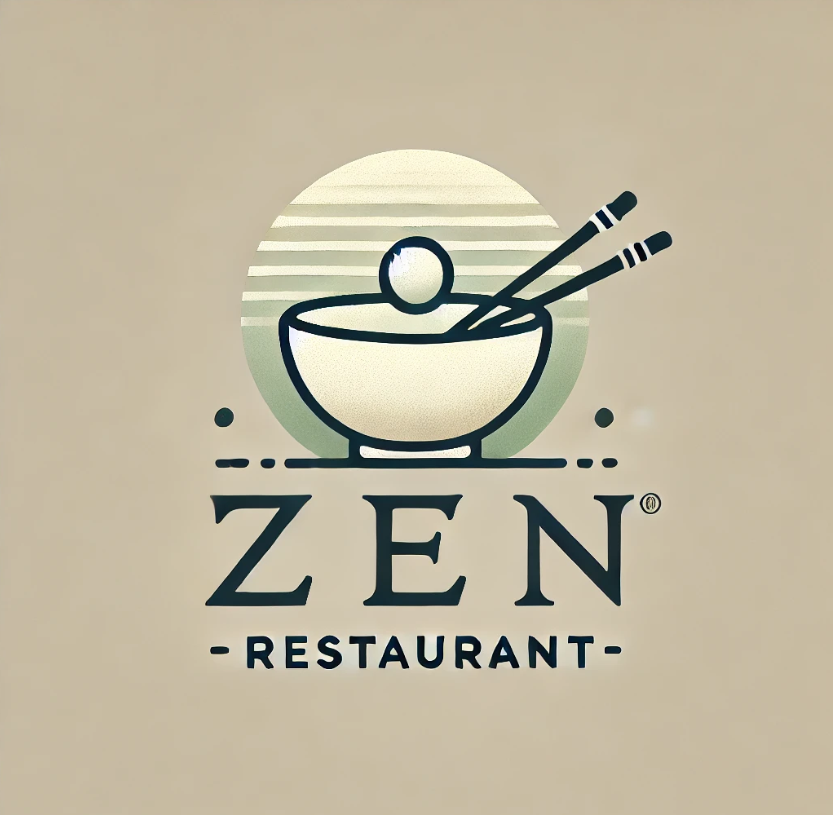
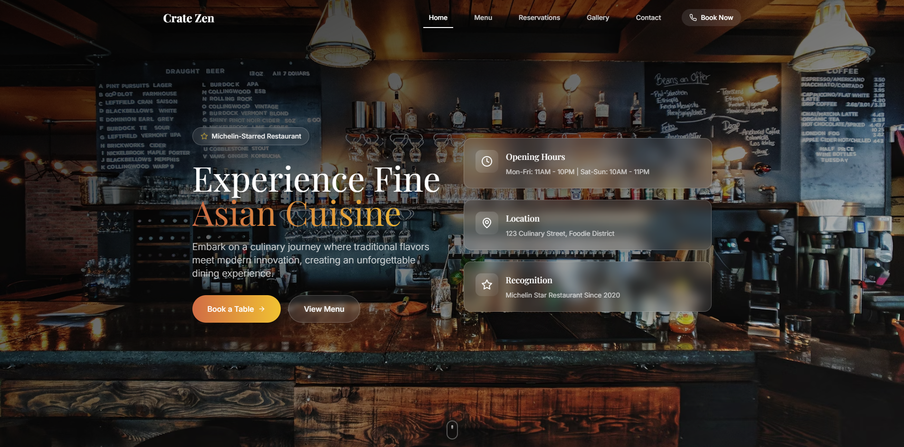
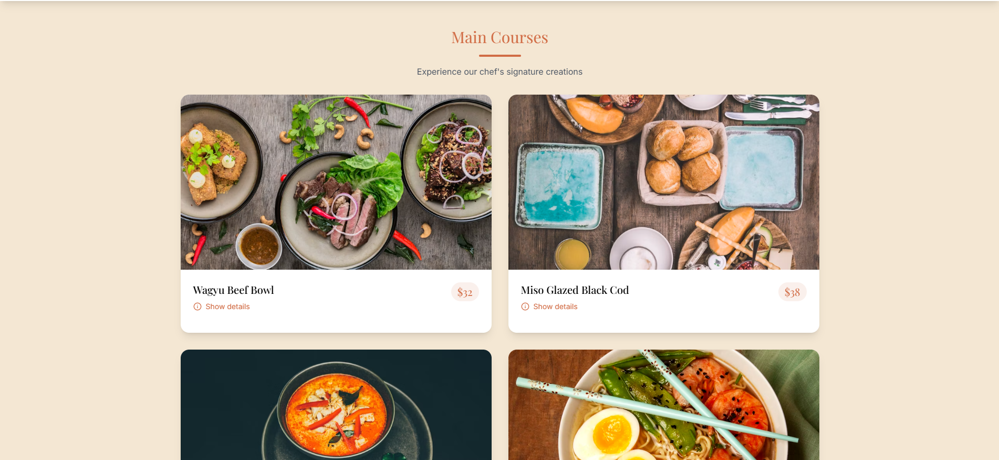
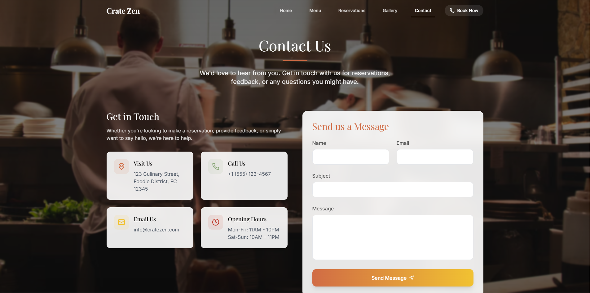

# 🌟 Zen Restaurant 🍽️

Welcome to **Zen Restaurant**, a modern dining experience that blends exquisite cuisine with serene ambiance. Enjoy a seamless user experience as you explore our menu, book reservations, and learn more about our story. Built with ❤️ using [Create React App](https://github.com/facebook/create-react-app).



---

## 🌟 Features
- 🍕 **Menu Showcase**: Browse through a variety of delicious dishes with detailed descriptions and pricing.
- 📅 **Reservation System**: Easily book your table online for a hassle-free dining experience.
- 🌐 **Responsive Design**: Optimized for all devices, ensuring a delightful experience on desktops, tablets, and mobiles.
- 🖼️ **Gallery**: Explore our beautiful interiors and culinary creations.
- 📞 **Contact Us**: Get in touch with us for inquiries or feedback.

---

## 🚀 Getting Started with Create React App

This project was bootstrapped with [Create React App](https://github.com/facebook/create-react-app).

### Prerequisites
- Install [Node.js](https://nodejs.org/) for running the app locally.
- Clone the repository and navigate to the project directory.

### Installation

```bash
# Clone the repository
git clone https://github.com/your-username/zen-restaurant.git

# Navigate to the project directory
cd zen-restaurant

# Install dependencies
npm install
```

---

## Available Scripts

In the project directory, you can run:

### `npm start`

Runs the app in the development mode.\
Open [http://localhost:3000](http://localhost:3000) to view it in the browser.\
The page will reload if you make edits.\
You will also see any lint errors in the console.

### `npm test`

Launches the test runner in the interactive watch mode.\
See the section about [running tests](https://facebook.github.io/create-react-app/docs/running-tests) for more information.

### `npm run build`

Builds the app for production to the `build` folder.\
The build is minified and the filenames include the hashes.\
Your app is ready to be deployed!

---

## 🌟 Learn More

To learn more about Create React App, check out the [Create React App documentation](https://facebook.github.io/create-react-app/docs/getting-started).\
To learn React, check out the [React documentation](https://reactjs.org/).

---

## 📸 Preview







---

## 🛠️ Technologies Used
- **Frontend**: React, Tailwind CSS


---

## 🤝 Contributing

We welcome contributions! Feel free to submit a pull request or report issues.

---

## 📧 Contact Us

Have any questions? Reach out to us at [Ishan Dhananjana](https://ishand.netlify.app).

---

### Happy Dining at Zen Restaurant! 🎉
